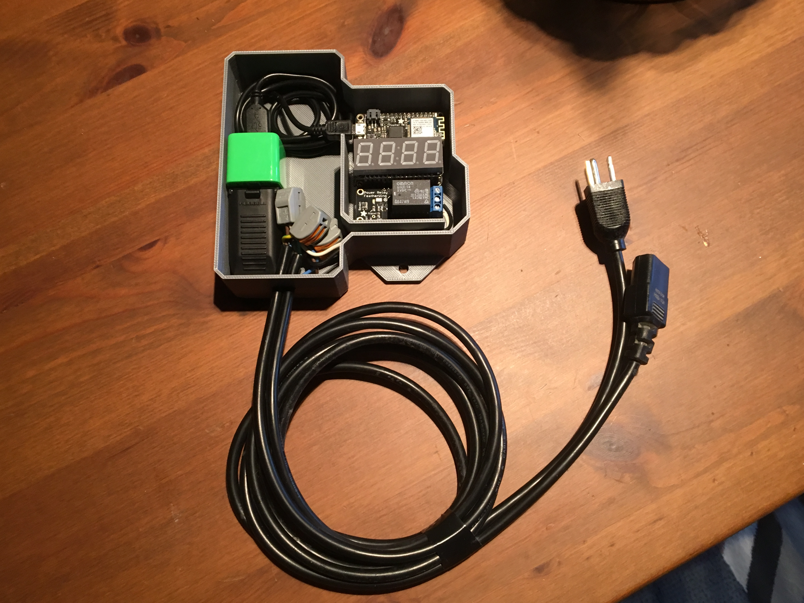
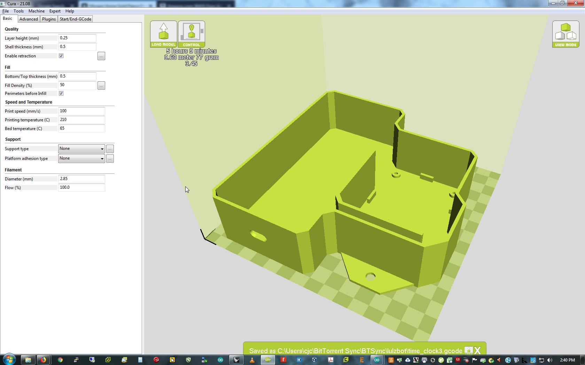
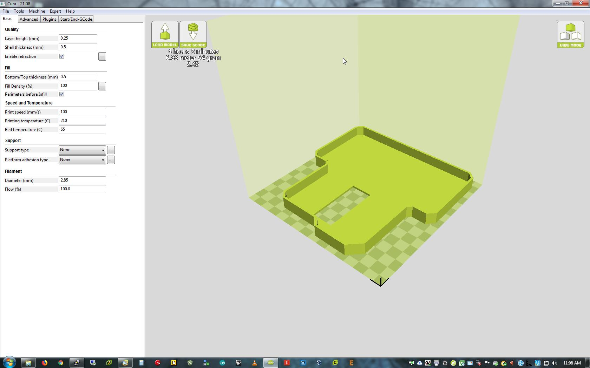

# Feather-RTC
## Overview
We use time clocks and horns on the shop floor to signal shift changes and breaks. The problem with electro-mechanical clocks is they break after a while, are expensive, and also need to be manually reset every time there's a power failure or a time change. 

This design is a fraction of the cost and also doesn't need to be manually reset. If WiFi is available it will sync to NTP. If not, the RTC will keep accurate time for years between power failures. It also adjusts automatically between standard and daylight saving time.

## Parts List
  * [Adafruit Feather M0 WiFi - ATSAMD21 + ATWINC1500](https://www.adafruit.com/product/3010)
  * [Adafruit 4-Digit 7-Segment LED Matrix Display FeatherWing](https://www.adafruit.com/product/3088)
  * [Adafruit DS3231 Precision RTC FeatherWing - RTC Add-on For Feather Boards](https://www.adafruit.com/product/3028)
  * [Adafruit Stacking Headers](https://www.adafruit.com/product/2830) (for the RTC only)
  * [Adafruit Power Relay FeatherWing](https://www.adafruit.com/product/3191)
  * [Adafruit FeatherWing Tripler Mini Kit - Prototyping Add-on For Feathers](https://www.adafruit.com/product/3417)
  * [USB cable - 6" A/MicroB](https://www.adafruit.com/product/898)
  * [Federal Signal 350-120-30 Vibratone Electro-Mechanical Horn, Surface Mount, 120 VAC](https://smile.amazon.com/gp/product/B003OU4HRA/ref=oh_aui_detailpage_o01_s00?ie=UTF8&psc=1)
  * AC power cables (salvaged from old PCs, printers)
  * USB charger cube (Lowes, drug stores)
  * [222-412 -  Standard Terminal Block, Grey, 222 Series, 2 Contacts, Terminal Block, Cable Mount, 12 AWG](https://www.newark.com/wago/222-412/terminal-block-pluggable-2-position/dp/45M7284?MER=bn_browse_1TP_MostPopular_1)
  * [	
222-413 -  Standard Terminal Block, Grey, 222 Series, 3 Contacts, Terminal Block, Cable Mount, 12 AWG ](https://www.newark.com/wago/222-413/terminal-block-pluggable-3-position/dp/28K2061?MER=bn_browse_1TP_MostPopular_1)
  * Hubbell RP102BKZ Commercial Straight connector or similar (Lowes)
    
## Enclosure and Assembly
This enclosure was printed in PLA. Use at least 50% infill, if you have the time 100% is better. 
  * After printing hand tap then secure the Feather tripler board using 2.5mm nylon screws
  * Install the Feather, RTC and LED wings
  * Complete the AC wiring then mount the relay wing

